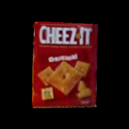

# Neural Object Learning for 6D Pose Estimation
An official implementation of the paper, Neural Object Learning for 6D Pose Estimation Using a Few Cluttered Images, ECCV 2020 Spotlight, https://arxiv.org/abs/2005.03717


### Requirements:
**The best way of running the code is using a nvidia-docker container**
* Docker + Nvidia-docker (https://github.com/NVIDIA/nvidia-docker)
* NVidia driver >=418.56
* CUDA = 10.1
* The requirments below are automatically installed when building a docker container
  * Tensorflow == 2.1.0
  * Dirt (https://github.com/kirumang/dirt.git), forked from (https://github.com/pmh47/dirt)
  * See python requirements in requirements.txt

---
### Citation
If you use this code, please cite the following
```
@InProceedings{Park_2020_ECCV,
author = {Park, Kiru and Patten, Timothy and Vincze, Markus},
title = {Neural Object Learning for 6D Pose Estimation Using a Few Cluttered Images},
booktitle = {European Conference on Computer Vision (ECCV)},
month = {Aug},
year = {2020}
}
```

---
### Environment setting using Nvidia-docker
1. git clone ```git clone --recurse-submodules https://github.com/kirumang/NOL.git```
2. Build Dockerfile ```bash docker_build.sh```
3. Edit docker_run.sh ```vim docker_run.sh```   
   - Set ```data_mount_arg``` to link dataset folders with the docker container
   - E.g., -v <path_to_dataset_local>:<path_to_dataset_container>
4. Start the container ```bash docker_run.sh```
5. Test using the example script (Rendering an image of the cracker_box in SMOT)

```
python3 examples/NOL_rendering_one.py cfg_camera/camera_SMOT.json sample_data/obj_01.hdf5
```

The code is ready to run if you can see a rendered image in the folder ```./result/obj_01/```,
with the following message.
```
Generated: ./results/obj_01/0000.png
```
The result image should look like this,



---
### Render an object from uniformly sample view points in the upper-hemisphere
This is an example code for rendering an object from various view points
The variable, ```max_iter```, can be reduced to increase the rendering speed
```
python3 examples/NOL_rendering.py <path/to/camera_cfg (.json)> <path/to/data (.hdf5)> <path/to/target (default: /result/filename/)>
```

---
### Preprocess source images  for LineMOD and SMOT datasets
- From the entire training set, a number of images is sampled as source images
- Please refer to the paper for more details of the process

1. Preprocess for the LineMOD objects: the result file (.hdf5) will be saved in ```sample_data/linemod``` folder
[Link to the LindMOD dataset @ BOP Challenge](https://bop.felk.cvut.cz/datasets/)
```
python3 data_processing/process_LineMOD_BOP.py [path/to/bop/lm] [obj_name e.g., obj_01,obj_02,...]
```

2. Preprocess for the SMOT objects: the result file (.hdf5) will be saved in ```sample_data/smot``` folder.
- Download and extract [the SMOT dataset](https://data.acin.tuwien.ac.at/index.php/s/JWsggGxLIq7nyAW), [Link to the SMOT dataset page](https://www.acin.tuwien.ac.at/en/vision-for-robotics/software-tools/smot)
- Run the sampling script (the ICP option is activated by default)
```
python3 data_processing/process_SMOT.py [path/to/smot] [obj_name e.g., obj_01,obj_02,...] [icp=yes(1)/no(0),default=1]
```

---
### Render a new object using your own images
a data file (.hdf5) should be created to render a new object from source images
1. Essential components and keys for N source images
- "vertices_3d": 3D vertices (Vx3, numpy array)
- "faces": face indices (Fx3, numpy array)
- "images": cropped patches of source images (Nx256x256x3, numpy array)
- "bboxes" : bboxes, defined in the original images, where the patches are cropped from (Nx4, numpy array, [v1,h1,v2,h2]) 
  - e.g., if a patch of the object is cropped from (100,200) - (150,400)
  - images[0] = a resized image of the region (100,200) - (150,400)
  - bboxes[0] = [100,200,150,400]
- "poses" : object poses (transformation matrix) in the source images (Nx4x4, numpy array)

2. Save the components to a hdf5 file
```
train_data = h5py.File(fn, "w")
train_data.create_dataset("vertices_3d",data=np.array(vertices_3d))
train_data.create_dataset("faces",data=np.array(faces))
train_data.create_dataset("images",data=np.array(input_imgs))
train_data.create_dataset("poses",data=np.array(poses_))
train_data.create_dataset("masks",data=np.array(masks))
train_data.create_dataset("bboxes",data=np.array(bboxes))
train_data.close() 
```
3. Define camera config (.json) file
- See ```cfg_camera/camera_Default.json``` for a reference

---

### Disclaimers:
* The paper should be cosidered the main reference for this work. All the details of the algorithm and the training are reported there
* Feel free to contact us when a new function is required for custom images

---
### Contributors:
* Kiru Park - email: park@acin.tuwien.ac.at / kirumang@gmail.com


